# AarogyaGrid

**One live view of medicine stock, beds and staff across India's public health system, from the primary health centre to the nation.**

AarogyaGrid predicts how much of each medicine every health centre will use over the next 30 days, warns days before something runs out, spots unusual jumps in demand that may signal an outbreak, and suggests the fastest fix: an order from the district warehouse, or spare stock from a nearby health centre. People approve every step; the system keeps the record.

Built for **Google Build with AI: Code for Communities** (Track 03: Smart Health & Supply Chain Resilience).

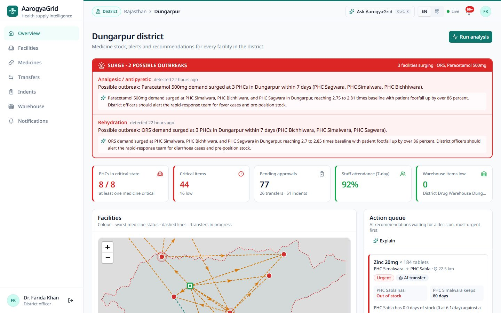

---

## The problem

- A primary health centre (PHC) usually finds out it has run out of a medicine when the shelf is empty and a patient is waiting.
- Orders are planned from last month's use plus a buffer, so seasonal rises and outbreaks arrive as shortages.
- A PHC 20 km away may be holding more of the same medicine than it can use before it expires.
- District and state officers mostly learn about shortages from monthly reports, weeks later.

## What AarogyaGrid does

- **Keeps count.** PHC staff record what they gave out and received each day, on a phone, by form or **by voice in any Indian language**.
- **Looks ahead.** A 30-day forecast for every medicine at every facility, using weekly patterns, seasons, patient numbers and recent trends.
- **Warns early.** *Critical* when a medicine will run out before a normal delivery can arrive; *low* when it is getting close. Also expiry, staff-shortage and bed-pressure alerts.
- **Spots surges and possible outbreaks.** A medicine used far faster than normal raises a surge alert; three or more PHCs surging on the same kind of medicine in one district raises a possible-outbreak alert for the district and the state.
- **Suggests the fix.** A warehouse order when there is time; otherwise a transfer from the nearest facility that can spare stock and still keep 45 days' worth. Stock close to expiry is offered to a facility that will use it in time.
- **People decide.** The PHC doctor signs off staff requests, the district officer approves orders and transfers, the state admin approves moves between districts. Stock changes only when the receiver confirms delivery.
- **Live for everyone in scope.** Screens update within seconds of any change, from the PHC to the national dashboard.

## Screens

| PHC staff (phone) | Voice entry | PHC doctor |
|---|---|---|
| 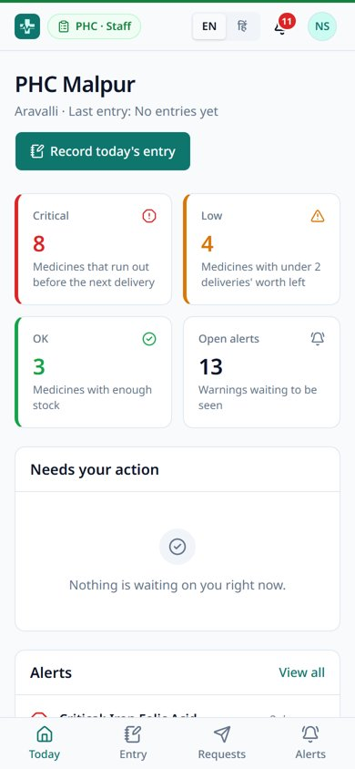 | 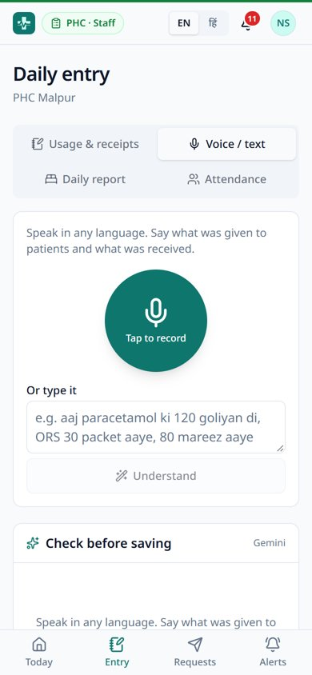 | 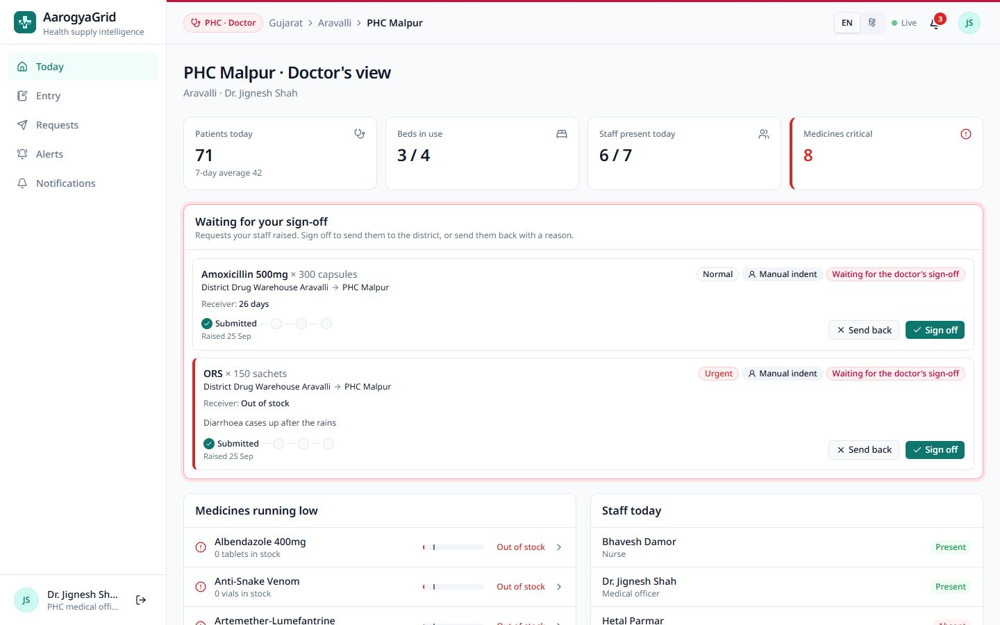 |

| District map | Forecast | National overview |
|---|---|---|
| 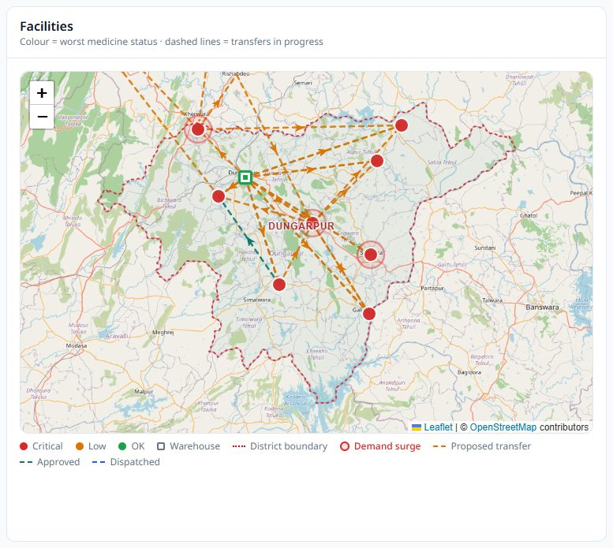 | 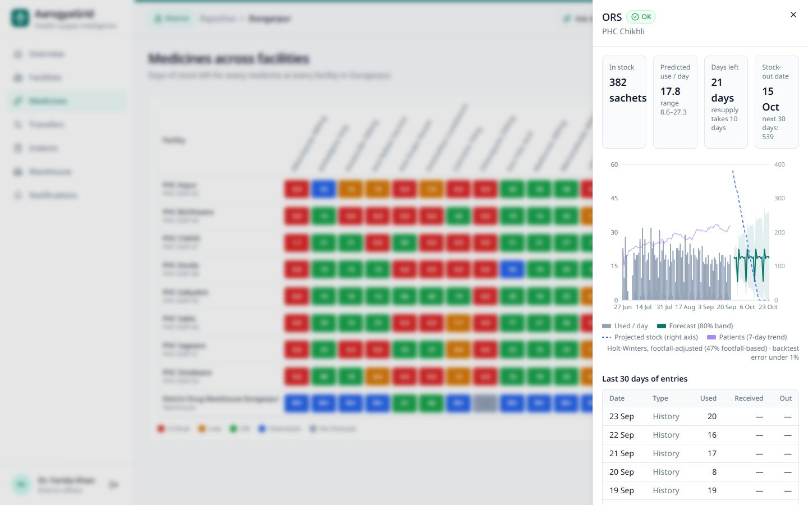 | 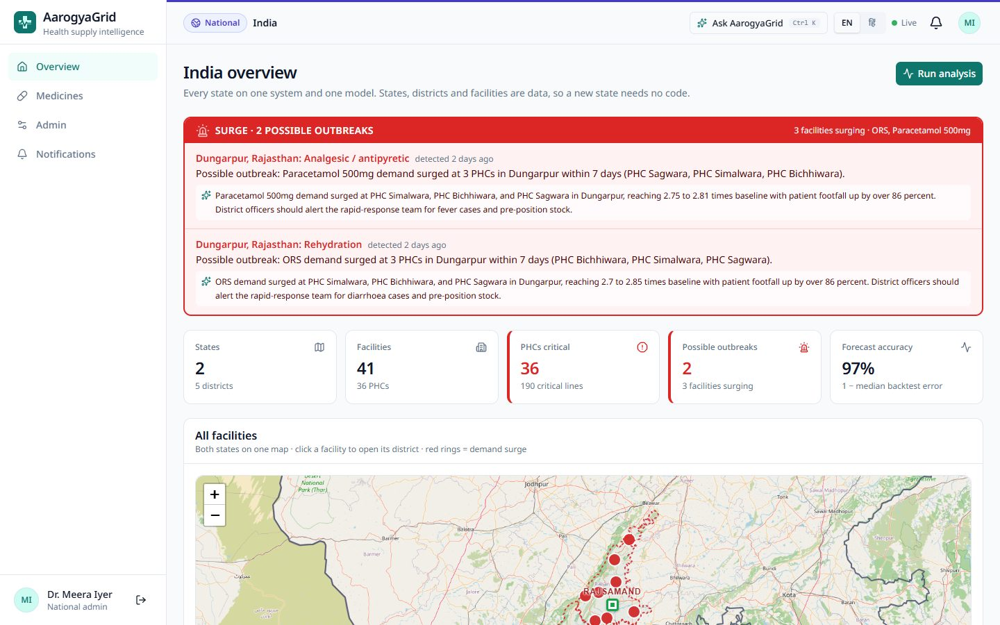 |

| Cross-district approval | Admin console: medicines | Asking for a new medicine |
|---|---|---|
| 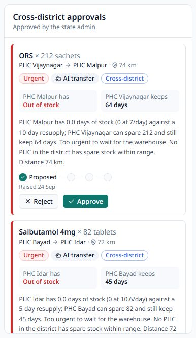 | 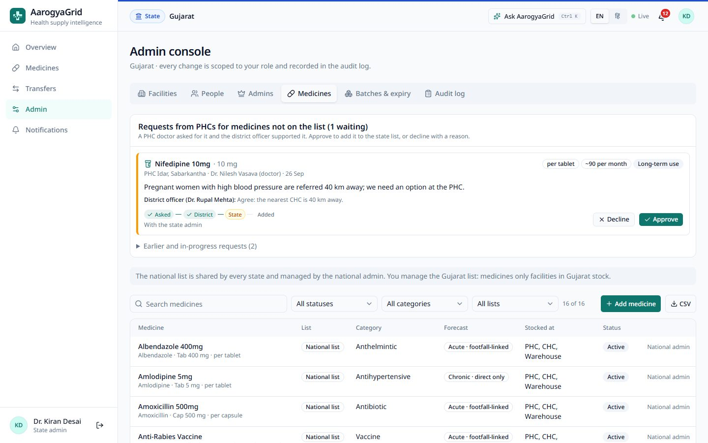 | 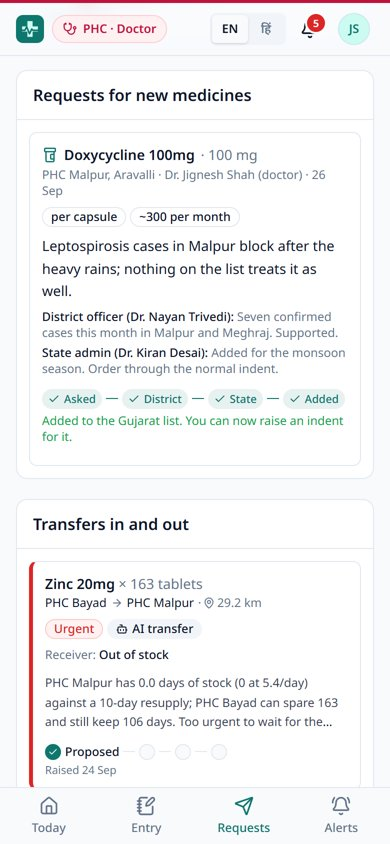 |

## Who uses it

Each person sees only their own area. This is enforced by the database (Row Level Security), not just hidden in the interface. A coloured badge at the top of every screen shows which view you are in.

| Role | What they do |
|---|---|
| **PHC staff** | Daily usage and receipts (form or voice), patients, beds, attendance; raise orders; send and receive transfers. English and Hindi. |
| **PHC doctor** | Patients, beds, staff and low medicines at a glance; signs off staff orders; asks for medicines that are not on the list. |
| **Warehouse manager** | Dispatches approved orders and transfers; watches warehouse stock. |
| **District officer** | Map of every facility, surge and outbreak alerts, AI action queue; approves orders and transfers; supports or turns down new-medicine requests. |
| **State admin** | District comparison, medicines at risk, moves between districts; keeps the state's own medicine list; admin console for the state. |
| **National admin** | Every state on one map, state comparison, forecast accuracy, outbreaks anywhere; keeps the national medicine list. |

**Admin console** (state and national admins): facilities (including spreadsheet import), people and invitations, admin handover, medicine lists and requests from PHCs, batches and expiry, and a searchable audit log of every change.

## How it works

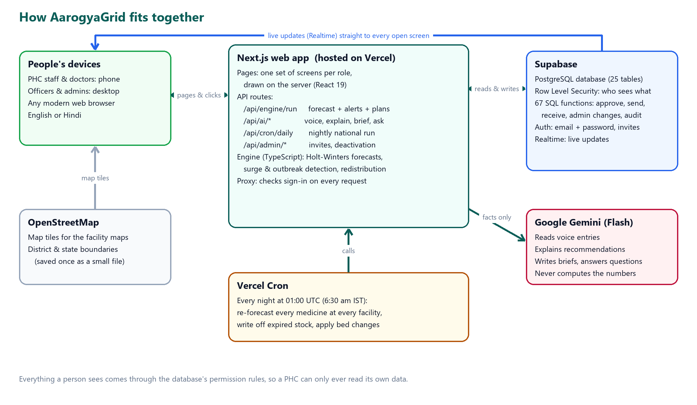

- **Next.js** serves every screen from the server with only the data that person may see, and hosts the API routes for the forecasting engine, the AI features and the nightly job.
- **Supabase (PostgreSQL)** holds all data. Row Level Security limits what each person can read; every action (approve, dispatch, receive, admin changes) is a database function that checks who is calling. Supabase Realtime pushes changes to open screens.
- **The engine** (`src/lib/engine`) is plain, unit-tested TypeScript. It runs after every PHC entry and for the whole country every night.
- **Gemini** is called only from the server, only with numbers the engine has already worked out.

How the real-world supply chain works today, and how AarogyaGrid maps onto it: [today](docs/screenshots/diagram-real-system.png) · [AarogyaGrid](docs/screenshots/diagram-aarogyagrid.png).

### Forecasting

- **Holt-Winters** (level, damped trend, weekly pattern) fitted to recent history, with a **same-season-last-year** adjustment so monsoon diarrhoea and post-monsoon malaria are expected before they arrive.
- Days when the shelf was empty or nothing was reported are treated as **missing, not zero demand**.
- For acute medicines, a **patient-count forecast** (medicine used per patient × expected patients) is blended in, weighted by how accurate each method has been. Chronic medicines use their own history.
- Facilities with under a year of history **borrow seasonal patterns** from their district, state or the whole country.
- Every forecast is **back-tested** on the last 14 days; accuracy is shown per state.

### Where AI is used

Gemini handles language; the engine handles numbers.

| Feature | What Gemini does |
|---|---|
| Voice / text entry | Turns *"aaj paracetamol ki 120 goliyan di, ORS 30 packet aaye"* into a list of medicines and quantities. The worker checks it before anything is saved. |
| Explanations | Rewrites each recommendation, surge and outbreak alert as two plain sentences: the likely cause and why this donor. |
| Situation briefs | 4–6 bullet points for district, state and national officers: what is wrong, what to do today, what is coming. |
| Ask AarogyaGrid | Answers questions from the asker's own data only. |

Every reply is checked against a strict format. If Gemini is unavailable, every screen keeps working with the engine's own written reasons.

## Tech stack

Next.js 16 (App Router, React 19, TypeScript) · Tailwind CSS 4 · shadcn/ui + Radix UI · Recharts · Leaflet + OpenStreetMap · Supabase (PostgreSQL, Auth, Row Level Security, Realtime) · Google Gen AI SDK (Gemini Flash) · zod · Vitest · Vercel (hosting and cron)

## Getting started

### Requirements

- Node.js 20 or newer
- A [Supabase](https://supabase.com) project
- A [Google AI Studio](https://aistudio.google.com) API key

### 1. Install

```bash
git clone https://github.com/<your-username>/aarogyagrid.git
cd aarogyagrid
npm install
cp .env.example .env.local
```

Fill in `.env.local`:

| Variable | Where to find it |
|---|---|
| `NEXT_PUBLIC_SUPABASE_URL`, `NEXT_PUBLIC_SUPABASE_ANON_KEY` | Supabase → Project Settings → API |
| `SUPABASE_SERVICE_ROLE_KEY` | Same page. Server only; never expose it. |
| `GEMINI_API_KEY`, `GEMINI_MODEL` | Google AI Studio (e.g. a current Flash model) |
| `CRON_SECRET` | Any long random string |
| `DEMO_PASSWORD` | The password for the demo accounts |
| `SUPABASE_DB_URL` | Optional: only for `npm run db:setup` |

### 2. Create the database

Either run everything with one command (needs `SUPABASE_DB_URL`):

```bash
npm run db:setup
```

or paste these files into the Supabase SQL editor, in this order:

1. `db/base/01_schema.sql`
2. `db/base/02_seed.sql`
3. `db/migrations/002_upgrade.sql`
4. `db/seed/002_upgrade_seed.sql`
5. `db/migrations/003_phc_doctors.sql`
6. `db/migrations/004_state_medicines.sql`

### 3. Create the demo accounts and run

```bash
npm run demo-users
npm run dev
```

Open http://localhost:3000 and use the **Demo accounts** panel to sign in as any role.

## Deploying

1. Push the repository to GitHub and import it in [Vercel](https://vercel.com/new).
2. Add the same environment variables in Vercel → Project → Settings → Environment Variables (`SUPABASE_DB_URL` is not needed).
3. Deploy. `vercel.json` schedules the nightly analysis (`/api/cron/daily`, 01:00 UTC); Vercel sends `CRON_SECRET` with each call.
4. In Supabase → Authentication → URL Configuration, set the **Site URL** to your Vercel address and add `https://<your-app>.vercel.app/**` to the redirect URLs, so invitation links work.

## Demo data

- **2 states, 5 districts, 36 PHCs, 5 district warehouses, 15 medicines**, about 14 months of daily history with realistic seasons.
- Facility names are real places in Udaipur, Rajsamand and Dungarpur (Rajasthan) and Aravalli and Sabarkantha (Gujarat). **All stock, patient and staff numbers are made up.**
- `db/demo/simulate_outbreak.sql` creates a fever and diarrhoea surge at three PHCs in Dungarpur; press **Run analysis** as the Dungarpur district officer to see the outbreak alert.

### Demo accounts

All use `DEMO_PASSWORD`, or sign in with one click from the login page.

| Role | Email |
|---|---|
| National admin | `national.admin@heal.demo` |
| State admins | `state.admin@heal.demo` (Rajasthan), `state.gujarat@heal.demo` (Gujarat) |
| District officers | `do.udaipur@`, `do.rajsamand@`, `do.dungarpur@`, `do.aravalli@`, `do.sabarkantha@heal.demo` |
| Warehouse managers | `wh.udaipur@`, `wh.rajsamand@`, `wh.dungarpur@`, `wh.aravalli@`, `wh.sabarkantha@heal.demo` |
| PHC staff | `phc.<facility-code>@heal.demo`, e.g. `phc.phc-udr-04@heal.demo` |
| PHC doctors | `mo.<facility-code>@heal.demo`, e.g. `mo.phc-arv-03@heal.demo` |

## Project structure

```
src/app/            screens for each role, admin console, API routes
src/lib/engine/     forecasting, alerts, redistribution (with tests)
src/lib/ai/         Gemini calls, prompts and response checks
src/components/     maps, charts, tables, dialogs, PHC and doctor screens
db/base/            base schema and Rajasthan demo data
db/migrations/      national level, surges, batches, admin console, doctors, medicine lists
db/seed/, db/demo/  Gujarat demo data; outbreak simulation
public/geo/         district and state boundaries (OpenStreetMap)
scripts/            database setup and demo accounts
```

## Tests

```bash
npm test            # engine tests
npm run lint
npm run typecheck
```

## Roadmap

- Connect to states' existing drug inventory software (e-Aushadhi / DVDMS)
- Block level, CHCs, sub-centres and district hospitals
- Monthly orders with many medicines
- Offline mode for PHCs with poor connectivity
- SMS / WhatsApp alerts
- Links to disease surveillance (IDSP / IHIP) and procurement

## Acknowledgements

Map data and district boundaries © [OpenStreetMap](https://www.openstreetmap.org/copyright) contributors.
