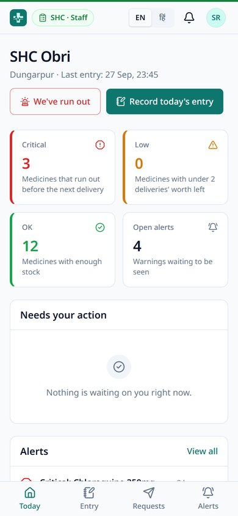
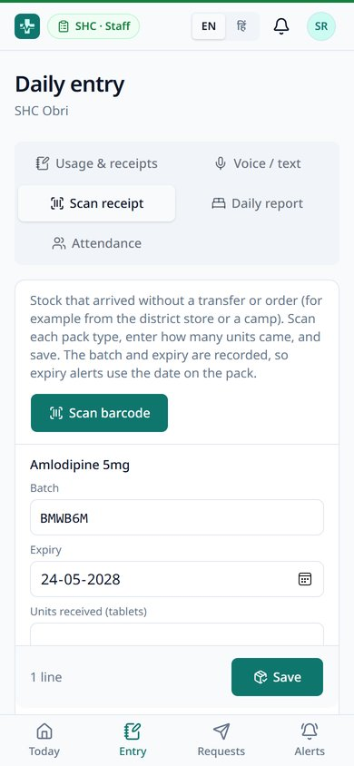
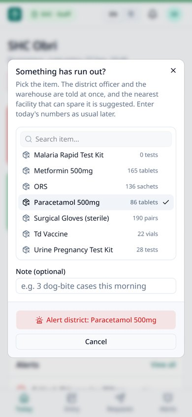
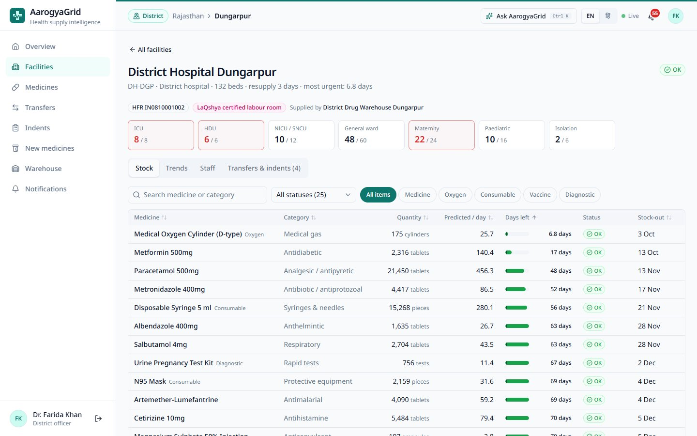
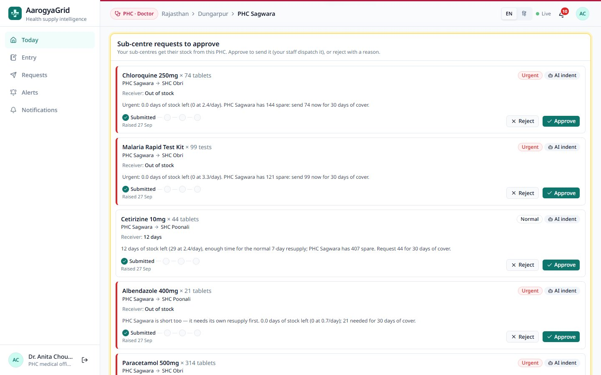
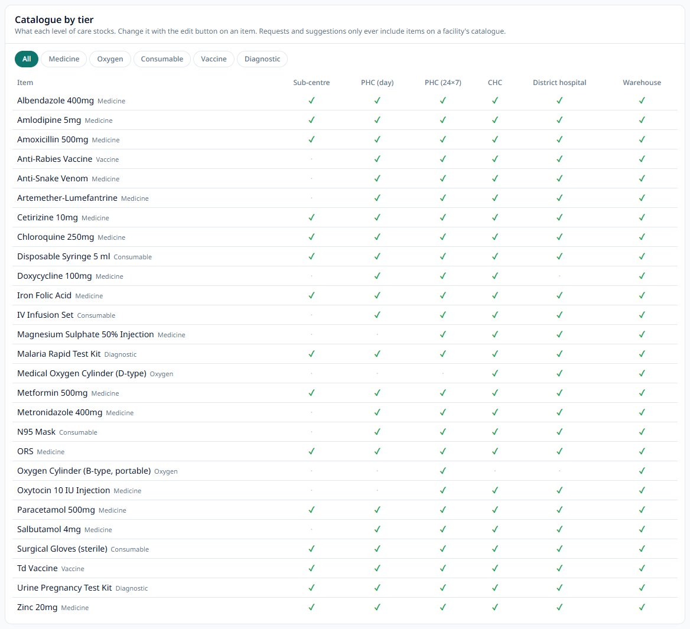

# AarogyaGrid

**One live view of medicine stock, beds and staff across India's public health system, from the primary health centre to the nation.**

AarogyaGrid predicts how much of each medicine every health centre will use over the next 30 days, warns days before something runs out, spots unusual jumps in demand that may signal an outbreak, and suggests the fastest fix: an order from the district warehouse, or spare stock from a nearby health centre. People approve every step; the system keeps the record.

**[Live demo](https://aarogyagrid-heal.vercel.app)** · Built for **Google Build with AI: Code for Communities** (Track 03: Smart Health & Supply Chain Resilience).


---

## The problem

- A primary health centre (PHC) usually finds out it has run out of a medicine when the shelf is empty and a patient is waiting.
- Orders are planned from last month's use plus a buffer, so seasonal rises and outbreaks arrive as shortages.
- A PHC 20 km away may be holding more of the same medicine than it can use before it expires.
- District and state officers mostly learn about shortages from monthly reports, weeks later.

## What AarogyaGrid does

- **Keeps count.** PHC staff record what they gave out and received each day, on a phone, by form or **by voice in any Indian language**.
- **Looks ahead.** A 30-day forecast for every medicine at every facility, using weekly patterns, seasons, patient numbers and recent trends.
- **Warns early.** *Critical* when a medicine will run out before a normal delivery can arrive; *low* when it is getting close. Also expiry, staff-shortage and bed-pressure alerts.
- **Spots surges and possible outbreaks.** A medicine used far faster than normal raises a surge alert; three or more PHCs surging on the same kind of medicine in one district raises a possible-outbreak alert for the district and the state.
- **"We've run out" in one tap.** When an item runs out mid-day, staff or the doctor tap one button. The district officer and warehouse are told at once, and a transfer from the nearest facility that can spare it is waiting for approval. The day's numbers are still entered later as usual.
- **Suggests the fix.** A warehouse order when there is time; otherwise a transfer from the nearest facility that can spare stock and still keep 45 days' worth. Stock close to expiry is offered to a facility that will use it in time.
- **People decide.** The PHC doctor signs off staff requests, the district officer approves orders and transfers, the state admin approves moves between districts. Stock changes only when the receiver confirms delivery.
- **Live for everyone in scope.** Screens update within seconds of any change, from the PHC to the national dashboard.
- **Follows the real chain of care.** Sub-centres are resupplied by their PHC; PHCs (day or 24×7), CHCs and district hospitals by the district warehouse. Each level has its own catalogue, so a sub-centre is never offered oxygen and only 24×7 PHCs stock delivery drugs.
- **Scans the pack.** A GS1 barcode (the DataMatrix on medicine packs) gives the batch number and expiry, so expiry alerts and first-expiry-first-out use the date printed on the pack. Expired stock is refused at receipt. Works with the phone camera on Android, or a handheld scanner.
- **More than medicines.** Oxygen, consumables, vaccines and diagnostic kits are tracked the same way. Beds are counted by type (general, maternity, ICU, HDU, NICU and more), and a full ICU for three days raises a critical alert.

## Screens

| PHC staff (phone) | Voice entry | PHC doctor |
|---|---|---|
|  |  |  |

| District map | Forecast | National overview |
|---|---|---|
|  |  |  |

| Sub-centre (phone) | Scanning a pack | "We've run out" |
|---|---|---|
|  |  |  |

| District hospital: beds by type | Sub-centre requests at the PHC | Catalogue by level of care |
|---|---|---|
|  |  |  |

| Cross-district approval | Admin console: medicines | Asking for a new medicine |
|---|---|---|
|  |  |  |

## Who uses it

Each person sees only their own area. This is enforced by the database (Row Level Security), not just hidden in the interface. A coloured badge at the top of every screen shows which view you are in.

| Role | What they do |
|---|---|
| **PHC staff** | Daily usage and receipts (form or voice), patients, beds, attendance; raise orders; send and receive transfers. English and Hindi. |
| **PHC doctor** | Patients, beds, staff and low medicines at a glance; signs off staff orders and orders from the PHC's sub-centres; asks for medicines that are not on the list. |
| **Sub-centre staff (ANM)** | Daily usage and receipts; orders go to their PHC, not the warehouse. |
| **CHC / district hospital** | The same staff and doctor views, with beds by type (ICU, HDU, NICU and more). |
| **Warehouse manager** | Dispatches approved orders and transfers; watches warehouse stock. |
| **District officer** | Map of every facility, surge and outbreak alerts, AI action queue; approves orders and transfers; supports or turns down new-medicine requests. |
| **State admin** | District comparison, medicines at risk, moves between districts; keeps the state's own medicine list; admin console for the state. |
| **National admin** | Every state on one map, state comparison, forecast accuracy, outbreaks anywhere; keeps the national medicine list. |

**Admin console** (state and national admins): facilities (including spreadsheet import), people and invitations, admin handover, medicine lists and requests from PHCs, batches and expiry, and a searchable audit log of every change.

## How it works


- **Next.js** serves every screen from the server with only the data that person may see, and hosts the API routes for the forecasting engine, the AI features and the nightly job.
- **Supabase (PostgreSQL)** holds all data. Row Level Security limits what each person can read; every action (approve, dispatch, receive, admin changes) is a database function that checks who is calling. Supabase Realtime pushes changes to open screens.
- **The engine** (`src/lib/engine`) is plain, unit-tested TypeScript. It runs after every PHC entry and for the whole country every night.
- **Gemini** is called only from the server, only with numbers the engine has already worked out.

How the real-world supply chain works today, and how AarogyaGrid maps onto it: [today](docs/screenshots/diagram-real-system.png) · [AarogyaGrid](docs/screenshots/diagram-aarogyagrid.png).

### Data exchange (FHIR R4)

A read-only [HL7 FHIR R4](https://hl7.org/fhir/R4/) API at `/api/fhir`, so state, national and ABDM-style systems can read AarogyaGrid's data in the standard format:

| Resource | From |
|---|---|
| `Organization`, `Location` | Facilities (with HFR ids, level of care, position, supplier), districts and states |
| `Medication`, `Device` | The item catalogue with GS1 barcodes (medicines, vaccines and oxygen; consumables and test kits) |
| `SupplyRequest` | Warehouse orders and transfers |
| `SupplyDelivery` | Dispatches and receipts, with the batch numbers and expiry dates that were sent |

`GET /api/fhir/metadata` describes the server. Callers sign in like any user (browser session, or `Authorization: Bearer <Supabase access token>`) and see only what their role allows. Search by `facility`, `district`, `status`, `identifier` (facility code, HFR id or GTIN), with `_count` and `_page`.

### Forecasting

- **Holt-Winters** (level, damped trend, weekly pattern) fitted to recent history, with a **same-season-last-year** adjustment so monsoon diarrhoea and post-monsoon malaria are expected before they arrive.
- Days when the shelf was empty or nothing was reported are treated as **missing, not zero demand**.
- For acute medicines, a **patient-count forecast** (medicine used per patient × expected patients) is blended in, weighted by how accurate each method has been. Chronic medicines use their own history.
- **Oxygen follows occupied ICU, HDU and NICU beds** instead of patient numbers.
- Maternal-care items at facilities with a **LaQshya**-certified labour room are handled first when stock is short.
- Facilities with under a year of history **borrow seasonal patterns** from their district, state or the whole country.
- Every forecast is **back-tested** on the last 14 days; accuracy is shown per state.

### Where AI is used

Gemini handles language; the engine handles numbers.

| Feature | What Gemini does |
|---|---|
| Voice / text entry | Turns *"aaj paracetamol ki 120 goliyan di, ORS 30 packet aaye"* into a list of medicines and quantities. The worker checks it before anything is saved. |
| Explanations | Rewrites each recommendation, surge and outbreak alert as two plain sentences: the likely cause and why this donor. |
| Situation briefs | 4–6 bullet points for district, state and national officers: what is wrong, what to do today, what is coming. |
| Ask AarogyaGrid | Answers questions from the asker's own data only. |

Every reply is checked against a strict format. If Gemini is unavailable, every screen keeps working with the engine's own written reasons.

## Tech stack

Next.js 16 (App Router, React 19, TypeScript) · Tailwind CSS 4 · shadcn/ui + Radix UI · Recharts · Leaflet + OpenStreetMap · Supabase (PostgreSQL, Auth, Row Level Security, Realtime) · Google Gen AI SDK (Gemini Flash) · zod · Vitest · Vercel (hosting and cron)

## Try it

**Live demo: [aarogyagrid-heal.vercel.app](https://aarogyagrid-heal.vercel.app)**

Open the site and pick any account in the **Demo accounts** panel on the login page: one click, no password. Each role sees only its own area. A good tour:

1. **Dungarpur · district** (Dr. Farida Khan): an outbreak warning, the facility map with district borders, and the action queue of suggested orders and transfers.
2. **PHC · Doctor**, then choose **PHC Malpur**: the doctor's day at a glance and staff requests waiting for sign-off. Switch to **Staff** to see the phone view, voice entry, **Scan receipt** (try the sample pack) and the **We've run out** button.
3. **Health facilities**, then choose **SHC Obri**: a sub-centre whose orders go to PHC Sagwara; sign in as the **PHC Sagwara** doctor to approve them. Then try **District Hospital Dungarpur · Doctor** to see ICU and HDU beds by type.
4. **Gujarat · state admin** (Dr. Kiran Desai): transfers between districts, and the Admin console with medicine requests from PHCs.
5. **India · national admin** (Dr. Meera Iyer): both states on one map, state comparison and forecast accuracy.

## Demo data

- **2 states, 5 districts, 36 PHCs, 12 sub-centres, 2 CHCs, 2 district hospitals, 5 district warehouses and 26 items** (medicines, oxygen, consumables, vaccines, diagnostic kits), about 14 months of daily history with realistic seasons.
- Jan Aushadhi stores can be shown on the map for reference; they are not part of the government stock chain.
- Facility names are real places in Udaipur, Rajsamand and Dungarpur (Rajasthan) and Aravalli and Sabarkantha (Gujarat). **All stock, patient and staff numbers are made up.** Sub-centre names, registry IDs (HFR, HPR), barcodes and LaQshya certifications are illustrative.
- `db/demo/realistic_month.sql` sets the demo to an ordinary month: most shelves stocked, a few items low, a handful of real shortages.
- `db/demo/simulate_outbreak.sql` creates a fever and diarrhoea surge at three PHCs in Dungarpur; press **Run analysis** as the Dungarpur district officer to see the outbreak alert.

### Demo accounts

Sign in with one click from the login page.

| Role | Email |
|---|---|
| National admin | `national.admin@heal.demo` |
| State admins | `state.admin@heal.demo` (Rajasthan), `state.gujarat@heal.demo` (Gujarat) |
| District officers | `do.udaipur@`, `do.rajsamand@`, `do.dungarpur@`, `do.aravalli@`, `do.sabarkantha@heal.demo` |
| Warehouse managers | `wh.udaipur@`, `wh.rajsamand@`, `wh.dungarpur@`, `wh.aravalli@`, `wh.sabarkantha@heal.demo` |
| PHC staff | `phc.<facility-code>@heal.demo`, e.g. `phc.phc-udr-04@heal.demo` |
| PHC doctors | `mo.<facility-code>@heal.demo`, e.g. `mo.phc-arv-03@heal.demo` |
| Sub-centre staff | `shc.<facility-code>@heal.demo`, e.g. `shc.shc-dgp-01@heal.demo` |
| CHC / district hospital | `staff.<facility-code>@heal.demo` and `mo.<facility-code>@heal.demo`, e.g. `mo.dh-dgp@heal.demo` |

## Project structure

```
src/app/            screens for each role, admin console, API routes (engine, AI, FHIR, nightly job)
src/lib/engine/     forecasting, alerts, redistribution (with tests)
src/lib/ai/         Gemini calls, prompts and response checks
src/lib/gs1.ts      reading GS1 / EAN barcodes on medicine packs
src/lib/fhir.ts     FHIR R4 resources
src/components/     maps, charts, tables, dialogs, scanner, PHC and doctor screens
db/base/            base schema and Rajasthan demo data
db/migrations/      database changes, applied in order (002–009)
db/seed/, db/demo/  demo data for both states and every level of care; demo scenarios
public/geo/         district and state boundaries (OpenStreetMap)
scripts/            database setup and demo accounts
```

## Tests

```bash
npm test            # engine, barcode and FHIR tests
npm run lint
npm run typecheck
```

## Roadmap

- Connect to states' existing drug inventory software (e-Aushadhi / DVDMS)
- Block level
- Monthly orders with many medicines
- Offline mode for PHCs with poor connectivity
- SMS / WhatsApp alerts
- Links to disease surveillance (IDSP / IHIP) and procurement

## Acknowledgements

Map data and district boundaries © [OpenStreetMap](https://www.openstreetmap.org/copyright) contributors.
